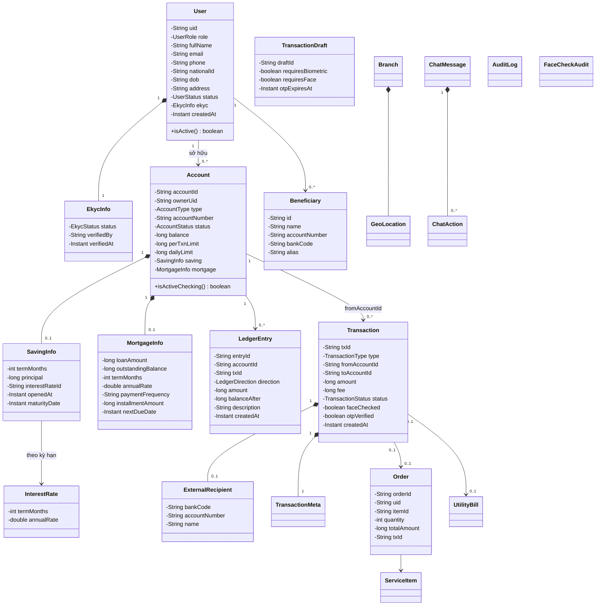
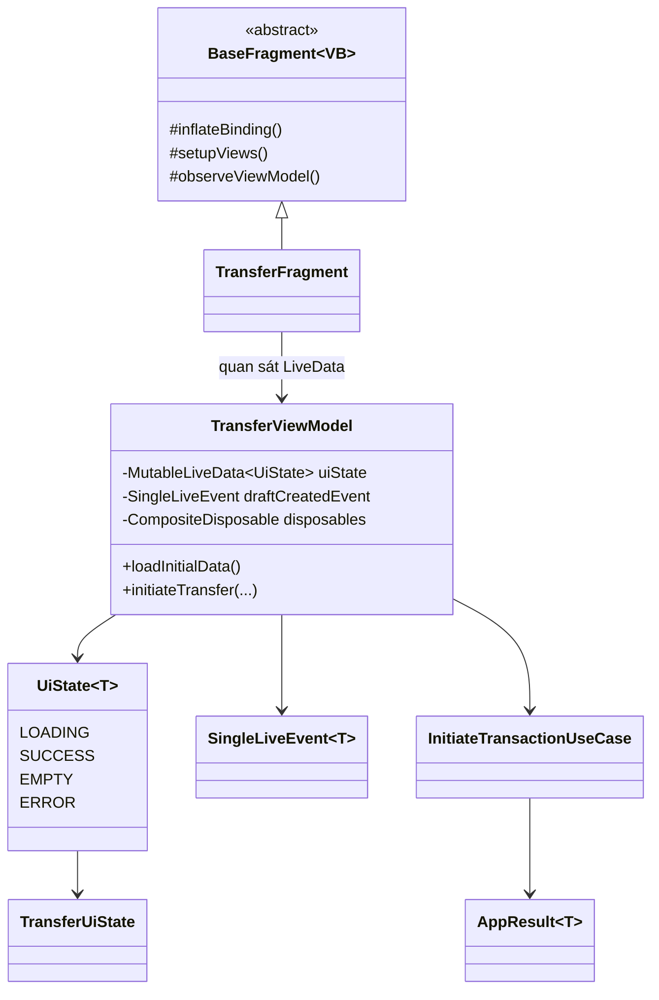
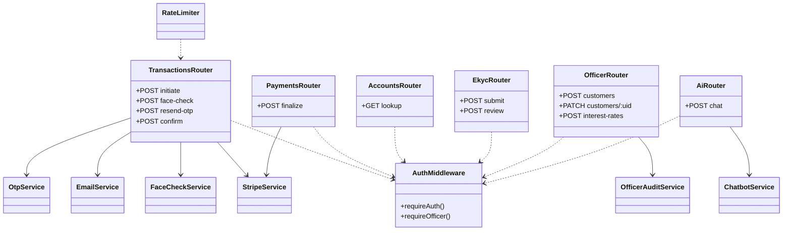

# Sơ đồ lớp (Class Diagram)

## 1. Domain model

```mermaid
classDiagram
    class User {
        -String uid
        -UserRole role
        -String fullName
        -String email
        -String phone
        -String nationalId
        -String dob
        -String address
        -UserStatus status
        -EkycInfo ekyc
        -Instant createdAt
        +isActive() boolean
    }
    class EkycInfo {
        -EkycStatus status
        -String verifiedBy
        -Instant verifiedAt
    }
    class Account {
        -String accountId
        -String ownerUid
        -AccountType type
        -String accountNumber
        -AccountStatus status
        -long balance
        -long perTxnLimit
        -long dailyLimit
        -SavingInfo saving
        -MortgageInfo mortgage
        +isActiveChecking() boolean
    }
    class SavingInfo {
        -int termMonths
        -long principal
        -String interestRateId
        -Instant openedAt
        -Instant maturityDate
    }
    class MortgageInfo {
        -long loanAmount
        -long outstandingBalance
        -int termMonths
        -double annualRate
        -String paymentFrequency
        -long installmentAmount
        -Instant nextDueDate
    }
    class LedgerEntry {
        -String entryId
        -String accountId
        -String txId
        -LedgerDirection direction
        -long amount
        -long balanceAfter
        -String description
        -Instant createdAt
    }
    class Transaction {
        -String txId
        -TransactionType type
        -String fromAccountId
        -String toAccountId
        -long amount
        -long fee
        -TransactionStatus status
        -boolean faceChecked
        -boolean otpVerified
        -Instant createdAt
    }
    class TransactionDraft {
        -String draftId
        -boolean requiresBiometric
        -boolean requiresFace
        -Instant otpExpiresAt
    }
    class TransactionMeta
    class ExternalRecipient {
        -String bankCode
        -String accountNumber
        -String name
    }
    class Beneficiary {
        -String id
        -String name
        -String accountNumber
        -String bankCode
        -String alias
    }
    class InterestRate {
        -int termMonths
        -double annualRate
    }
    class UtilityBill
    class ServiceItem
    class Order {
        -String orderId
        -String uid
        -String itemId
        -int quantity
        -long totalAmount
        -String txId
    }
    class Branch
    class GeoLocation
    class ChatMessage
    class ChatAction
    class AuditLog
    class FaceCheckAudit

    User "1" *-- "1" EkycInfo
    User "1" --> "0..*" Account : sở hữu
    Account "1" *-- "0..1" SavingInfo
    Account "1" *-- "0..1" MortgageInfo
    Account "1" --> "0..*" LedgerEntry
    Account "1" --> "0..*" Transaction : fromAccountId
    Transaction "1" *-- "0..1" ExternalRecipient
    Transaction "1" *-- "1" TransactionMeta
    Transaction "0..1" --> "0..1" Order
    Transaction "0..1" --> "0..1" UtilityBill
    SavingInfo --> InterestRate : theo kỳ hạn
    User "1" --> "0..*" Beneficiary
    Order --> ServiceItem
    Branch *-- GeoLocation
    ChatMessage "1" *-- "0..*" ChatAction
```

## 2. Repository, UseCase và triển khai

```mermaid
classDiagram
    class AccountRepository {
        <<interface>>
        +observeMyAccounts() Observable
        +observeAccountById(id) Observable
        +getAccountById(id) Single
    }
    class TransactionRepository {
        <<interface>>
        +lookupInternalAccount(number) Single
        +initiateTransaction(request) Single
        +confirmTransaction(draftId, otp, biometricPassed) Single
        +resendOtp(draftId) Single
        +finalizeStripePayment(draftId) Single
        +getTransactionById(txId) Single
    }
    class LedgerRepository {
        <<interface>>
        +observeLedger(accountId, direction, from, to) Observable
    }
    class AuthRepository {
        <<interface>>
        +signIn(email, password) Single
        +refreshRole() Single
        +signOut()
    }
    class OfficerRepository {
        <<interface>>
    }
    class ChatRepository {
        <<interface>>
    }
    class BranchRepository {
        <<interface>>
    }

    class AccountRepositoryImpl
    class TransactionRepositoryImpl
    class LedgerRepositoryImpl
    class AuthRepositoryImpl
    class OfficerRepositoryImpl
    class ChatRepositoryImpl
    class BranchRepositoryImpl

    AccountRepository <|.. AccountRepositoryImpl
    TransactionRepository <|.. TransactionRepositoryImpl
    LedgerRepository <|.. LedgerRepositoryImpl
    AuthRepository <|.. AuthRepositoryImpl
    OfficerRepository <|.. OfficerRepositoryImpl
    ChatRepository <|.. ChatRepositoryImpl
    BranchRepository <|.. BranchRepositoryImpl

    class TransactionApi {
        <<Retrofit>>
    }
    class PaymentApi {
        <<Retrofit>>
    }
    class AccountLookupApi {
        <<Retrofit>>
    }
    class MoneyFirestoreDataSource
    class FirestoreLedgerDataSource
    class FirebaseAuthDataSource
    class ApiErrorParser

    TransactionRepositoryImpl --> TransactionApi
    TransactionRepositoryImpl --> PaymentApi
    TransactionRepositoryImpl --> AccountLookupApi
    TransactionRepositoryImpl --> MoneyFirestoreDataSource
    TransactionRepositoryImpl --> ApiErrorParser
    LedgerRepositoryImpl --> FirestoreLedgerDataSource
    AuthRepositoryImpl --> FirebaseAuthDataSource

    class InitiateTransactionUseCase
    class ConfirmTransactionUseCase
    class ResendOtpUseCase
    class FinalizeStripePaymentUseCase
    class ObserveMonthlyCashflowUseCase
    class ObserveSavingProjectionUseCase
    class SignInUseCase

    InitiateTransactionUseCase --> TransactionRepository
    ConfirmTransactionUseCase --> TransactionRepository
    ResendOtpUseCase --> TransactionRepository
    FinalizeStripePaymentUseCase --> TransactionRepository
    ObserveMonthlyCashflowUseCase --> AccountRepository
    ObserveMonthlyCashflowUseCase --> LedgerRepository
    SignInUseCase --> AuthRepository
```

## 3. Mẫu MVVM của một màn hình

```mermaid
classDiagram
    class BaseFragment~VB~ {
        <<abstract>>
        #inflateBinding()
        #setupViews()
        #observeViewModel()
    }
    class TransferFragment
    class TransferViewModel {
        -MutableLiveData~UiState~ uiState
        -SingleLiveEvent draftCreatedEvent
        -CompositeDisposable disposables
        +loadInitialData()
        +initiateTransfer(...)
    }
    class TransferUiState
    class UiState~T~ {
        LOADING
        SUCCESS
        EMPTY
        ERROR
    }
    class SingleLiveEvent~T~
    class AppResult~T~

    BaseFragment <|-- TransferFragment
    TransferFragment --> TransferViewModel : quan sát LiveData
    TransferViewModel --> UiState
    UiState --> TransferUiState
    TransferViewModel --> SingleLiveEvent
    TransferViewModel --> InitiateTransactionUseCase
    InitiateTransactionUseCase --> AppResult
```

## 4. Backend (TypeScript)

```mermaid
classDiagram
    class TransactionsRouter {
        +POST initiate
        +POST face-check
        +POST resend-otp
        +POST confirm
    }
    class PaymentsRouter {
        +POST finalize
    }
    class AccountsRouter {
        +GET lookup
    }
    class EkycRouter {
        +POST submit
        +POST review
    }
    class OfficerRouter {
        +POST customers
        +PATCH customers/:uid
        +POST interest-rates
    }
    class AiRouter {
        +POST chat
    }
    class OtpService
    class EmailService
    class FaceCheckService
    class StripeService
    class ChatbotService
    class OfficerAuditService
    class RateLimiter
    class AuthMiddleware {
        +requireAuth()
        +requireOfficer()
    }

    TransactionsRouter --> OtpService
    TransactionsRouter --> EmailService
    TransactionsRouter --> FaceCheckService
    TransactionsRouter --> StripeService
    PaymentsRouter --> StripeService
    AiRouter --> ChatbotService
    OfficerRouter --> OfficerAuditService
    TransactionsRouter ..> AuthMiddleware
    PaymentsRouter ..> AuthMiddleware
    AccountsRouter ..> AuthMiddleware
    EkycRouter ..> AuthMiddleware
    OfficerRouter ..> AuthMiddleware
    AiRouter ..> AuthMiddleware
    RateLimiter ..> TransactionsRouter
```
